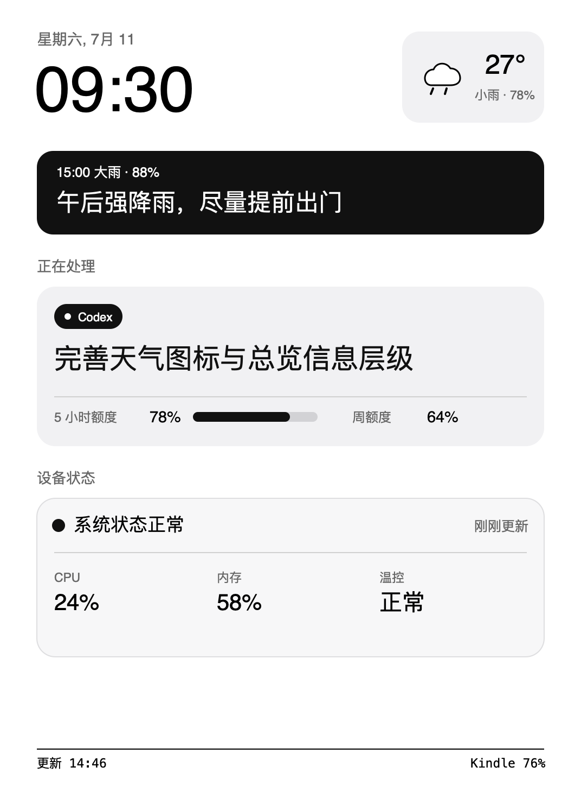
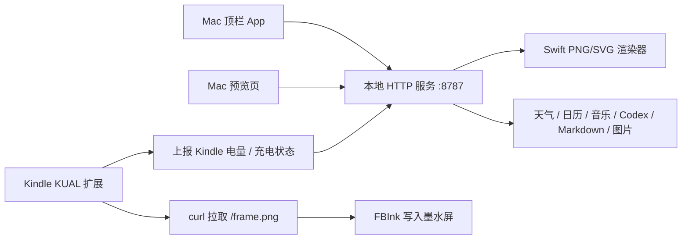

<div align="center">

# KindleDashboard

### 把 Kindle Paperwhite 变成 Mac 顶栏控制的电子墨水信息牌

[](https://www.swift.org)
[](https://www.apple.com/macos/)
[](#适配设备)
[](LICENSE)

Mac 控制，Kindle 显示。适合放在桌面上显示天气、时间、日程、音乐、Codex 工作状态、Markdown 步骤文档和静态图片。

Made by **ShaneStudio**

</div>



## 项目定位

KindleDashboard 不是传统意义上的第二显示器。它把 Kindle 当成一块低频、低功耗、强可读性的电子墨水状态屏：

- Mac 端运行一个本地服务和顶栏控制器。
- Kindle 端通过 KUAL 扩展拉取 Mac 渲染好的 PNG 画面。
- 所有核心内容都按 Kindle Paperwhite 3 的竖屏 1072 x 1448 分辨率设计。
- 页面以中文为主，强调远距离一眼能看懂，而不是把电脑屏幕缩小塞进去。

这个方案特别适合：

- 桌面常驻信息牌：天气、时间、日程、音乐、系统状态。
- Codex / agent 工作板：显示当前任务、最近工作、下一步。
- 操作步骤对照屏：把 Markdown 文档投射到 Kindle，边操作边看。
- 低打扰屏保：离开电脑时显示时间、日期或简单状态。

## 当前能力

- **Mac 顶栏入口**：从菜单栏切换 Kindle 页面、强制刷新、切换背光、查看状态。
- **Kindle Clean Dashboard**：暂停 Kindle 原生状态栏，避免系统时间和电量覆盖顶栏并产生白角。
- **分层刷新**：默认 1 分钟轻刷新、5 分钟全刷新，兼顾残影和寿命。
- **设备电量回传**：Kindle 把电量和充电状态上报给 Mac，页面右下角紧凑显示。
- **Markdown 投射**：上传或输入 Markdown，按页显示，适合步骤文档。
- **图片/截图投射**：把图片或屏幕截图转换为 Kindle 画面。
- **音乐控制页**：显示播放状态，并预留上一曲、播放/暂停、下一曲交互。
- **实验性电池保护**：提供充电守护脚本，用于长期插电时降低电池压力。

## 适配设备

已实机验证：

| 设备 | 状态 | 说明 |
| --- | --- | --- |
| Kindle Paperwhite 3 / PW3 | 已验证 | 1072 x 1448 竖屏布局，KUAL + FBInk 渲染 |

理论上可尝试：

| 设备 | 预期 | 注意 |
| --- | --- | --- |
| 其他支持 KUAL 和 FBInk 的 Kindle | 需要适配 | 分辨率、DPI、状态栏行为可能不同 |
| Kindle Oasis / Voyage | 需要适配 | 需要重新校准画布、字体和触控区域 |

不建议当前版本直接使用在：

- 未越狱或无法运行 KUAL 的 Kindle。
- 彩屏或 Android e-ink 设备。它们可以用浏览器方案，但不是本项目当前目标。

## 法律与安全边界

本仓库不提供 Kindle 越狱工具，不打包越狱文件，也不写逐步越狱教程。

你需要自己确认设备所有权、当地法律和风险，并参考上游资料完成 Kindle 的 post-jailbreak 环境准备：

- [Kindle Modding: Jailbreaking](https://kindlemodding.org/jailbreaking/)
- [Kindle Modding: After Jailbreak](https://kindlemodding.org/jailbreaking/AfterJailbreak/)
- [Kindle Modding: Post Jailbreak / Hotfix](https://kindlemodding.org/jailbreaking/post-jailbreak/setting-up-a-hotfix/)
- [KUAL](https://kindlemodding.org/kual/)
- [FBInk](https://github.com/NiLuJe/FBInk)

本项目只处理 post-jailbreak 之后的本地仪表盘、KUAL 启动脚本和 Mac 控制端。

## 系统架构



Mac 负责：

- 运行顶栏菜单。
- 提供 `http://<mac-ip>:8787/frame.png`。
- 渲染所有页面，保证 Kindle 只需要拉取一张图片。
- 接收 Kindle 状态上报。
- 保存当前页面、Markdown 页码、图片页、刷新策略等控制状态。

Kindle 负责：

- 在 KUAL 中启动或停止 dashboard。
- 用 `curl` 拉取 Mac 端 PNG。
- 用 `fbink` 显示画面。
- 在 Clean Dashboard 模式中暂停原生状态栏。
- 按固定策略执行轻刷新和全刷新。
- 上报电量和充电状态。

## 快速开始

### 1. 克隆项目

```bash
git clone https://github.com/Mibslee/kindledashboard.git
cd kindledashboard
```

### 2. 构建并启动 Mac 端

```bash
swift build
swift run KindleDashboard
```

启动后访问：

```text
http://127.0.0.1:8787/
http://127.0.0.1:8787/frame.png
```

`/` 是 Mac 预览和控制页，`/frame.png` 是 Kindle 实际显示的画面。

### 3. 找到 Mac 局域网 IP

```bash
ipconfig getifaddr en0
```

假设返回：

```text
192.168.1.23
```

后续命令里的 `<mac-ip>` 就替换成这个地址。

### 4. 准备 Kindle 环境

Kindle 侧需要已经具备：

- 已完成你自己负责的 post-jailbreak 环境。
- KUAL 可打开。
- FBInk 可用。
- Kindle 与 Mac 在同一局域网中，或 Kindle 能访问 Mac 的 `8787` 端口。

在 Kindle 上可以先测试 Mac 服务是否可达：

```bash
curl -I http://<mac-ip>:8787/frame.png
```

预期能看到 `HTTP/1.1 200 OK`。

### 5. 安装 KUAL 扩展

如果 Kindle 通过 USB 挂载到了 Mac 的 `/Volumes/Kindle`：

```bash
scripts/sync-kindle-extension.sh <mac-ip>
diskutil eject /Volumes/Kindle
```

脚本会把 `kindle-extension/kindledashboard` 同步到 Kindle 的 `extensions/kindledashboard`，并把 Mac IP 写入 Kindle 端配置。

如果手动安装，目标结构应类似：

```text
/Volumes/Kindle/extensions/kindledashboard/
  menu.json
  bin/
    show_once.sh
    render_once.sh
    start.sh
    stop.sh
    start_clean_dashboard.sh
    stop_clean_dashboard.sh
    restore_statusbar.sh
```

### 6. 在 Kindle 上启动

打开 KUAL，进入 `KindleDashboard`：

- `Show Once`：只渲染一次，用于快速测试。
- `Start Auto Refresh`：常规自动刷新。
- `Start Clean Dashboard`：推荐日常使用，暂停 Kindle 原生状态栏并自动刷新。
- `Stop Clean Dashboard`：停止 dashboard 并恢复 Kindle 状态栏。
- `Restore Statusbar`：手动恢复状态栏，用于异常恢复。

首次建议使用：

```text
Start Clean Dashboard
```

如果页面稳定显示，并且顶部不再出现 Kindle 原生时间和电量，说明 Clean Dashboard 模式正常。

## 日常使用

### Mac 顶栏控制端

Mac 顶栏控制端是这个项目的核心亮点：Kindle 只负责稳定显示，真正的控制入口留在 Mac 上。

这样设计有三个原因：

- Kindle 触控区域少，顶部还容易和系统下拉菜单冲突。
- e-ink 不适合高频交互，Mac 菜单更快、更确定。
- 所有高级设置留在 Mac 上，Kindle 端就能保持“像信息牌一样安静”。

当前顶栏菜单包含：

| 控制项 | 作用 | 用户收益 |
| --- | --- | --- |
| 页面切换 | 首页、Codex、音乐、天气、日历、专注、系统、屏保、文档、图片 | 不碰 Kindle 就能换内容 |
| 立即刷新 Kindle | 请求 Kindle 马上拉取新画面 | 切换页面或更新文档后立即生效 |
| Kindle 背光 | 开关 Kindle 前光，并在菜单里显示已开启/已关闭 | 夜间或弱光环境下不用进 Kindle 设置 |
| 电池保护 | 开关 45%-55% 充电守护，并在菜单里显示已开启/已关闭 | 长期插电时减少满电压力 |
| 刷新策略 | 调整轻刷新和全刷新频率，页面切换立即轻刷新 | 明确知道屏幕为何何时刷新，并按使用场景控制闪屏频率 |
| Markdown 文档 | 选择 `.md` / `.markdown` / 文本文档并分页投射 | 操作步骤可以放在 Kindle 上对照 |
| 图片/截图投射 | 选择图片或投射当前截屏 | 临时参考图、流程图、截图可直接上屏 |
| 音乐控制 | 播放/暂停、上一首、下一首 | Kindle 作为桌面音乐状态牌时可顺手控制 |

背光、电池保护、自动轮换这类开关不是只写成“开/关”，菜单项会直接显示当前状态，并用 macOS 菜单勾选状态同步反馈。

### 从 Mac 切换页面

启动 `KindleDashboard` 后，Mac 顶栏会出现 KindleDashboard 图标。菜单中可以切换：

- 首页
- Codex 工作板
- 音乐
- 天气
- 日历
- 专注
- 系统
- 屏保
- Markdown 文档
- 图片/截图

切换页面后，Mac 会立即让 Kindle 轻刷新一次，不必等下一轮定时刷新。

### 从 Kindle 切换页面

当前版本优先使用 Mac 顶栏控制。Kindle 屏幕顶部左侧的图标区域不会作为主要入口，因为它容易与 Kindle 系统下拉菜单产生冲突。

后续如果增加 Kindle 端手动触控，会采用更低风险的底部或侧边触控区域。

### 强制刷新

Mac 菜单提供即时刷新。适合：

- 刚切换页面。
- 刚更新 Markdown 或图片。
- 看到 e-ink 残影。
- Kindle 网络短暂断开后恢复。

Kindle 自动刷新策略仍会继续运行。

## 页面说明

### 首页

首页是默认状态屏。它回答三个问题：

- 现在是什么时间和天气？
- 今天有没有下一件要注意的事？
- Mac / Kindle 是否处于可用状态？

底部小卡片可用于天气、时间、音乐、日历等常驻小组件。

### Codex 工作板

用于显示 agent / Codex 相关状态。设计原则是只显示能帮助用户判断“现在要不要看电脑”的信息：

- 当前状态。
- 最近任务。
- 下一步。
- 关键异常或等待动作。

不显示原始端口、本地 URL、调试字段等低价值信息。

### 音乐

用于桌面播放场景：

- 当前播放状态。
- 曲目和艺人。
- 上一曲 / 播放暂停 / 下一曲。

如果系统没有播放音乐，会显示明确的未播放状态，避免误以为数据坏了。

### 天气

适合放在桌面常驻：

- 当前温度。
- 体感温度。
- 湿度。
- 天气图形符号。
- 简短行动建议。

### 日历

用于快速确认今天是否有日程。后续可以接入系统日历或 CalDAV。

### Markdown 文档

适合把操作步骤、排障手册、部署清单扔到 Kindle 上对照。

页面过长时，Mac 端会按 Kindle 阅读尺寸分页。你可以在 Mac 端切换上一页 / 下一页，然后立即刷新 Kindle。

### 图片 / 截图

适合显示：

- 操作截图。
- 设计参考。
- 二维码或静态说明图。
- 小尺寸流程图。

图片会转为适合 e-ink 的黑白画面。复杂彩色截图建议先裁剪，避免文字过小。

## 刷新策略

Kindle 的 e-ink 屏幕不适合像普通显示器一样高频刷新。当前默认策略：

| 类型 | 默认频率 | 用途 |
| --- | --- | --- |
| 轻刷新 | 1 分钟一次 | 更新时间、状态、小变化，减少闪屏 |
| 全刷新 | 5 分钟一次 | 清理残影，恢复画面干净度 |
| 立即刷新 | 页面切换或手动触发 | 让切换马上生效 |

这一策略比“每次都全刷”更适合长期桌面使用。Mac 顶栏设置里可以分别调整轻刷新和全刷新频率：日常桌面信息牌建议保持 1 分钟轻刷新、5 分钟全刷新；如果只看静态文档或图片，可以适当拉长全刷新间隔，减少闪屏。

## Clean Dashboard 模式

普通 KUAL 应用运行时，Kindle 原生系统可能会在顶部周期性局部刷新时间和电量。这个行为会把深色顶栏左右角刷白。

`Start Clean Dashboard` 会尽量暂停原生状态栏，再渲染 dashboard，因此：

- 不再需要为 Kindle 原生状态栏预留顶部白边。
- 顶栏可以贴近屏幕上沿，屏幕利用率更高。
- 不容易出现系统时间、电池覆盖自定义 UI 的问题。

如果退出后状态栏没有恢复，使用 KUAL 中的：

```text
Restore Statusbar
```

## 背光控制

Mac 顶栏提供背光开关入口，菜单中会显示：

- `Kindle 背光：已开启（10）`
- `Kindle 背光：已关闭`

Kindle 端会尽量调用设备可用的前光控制命令。当前默认亮度级别是 `10`，后续可以扩展为菜单滑块或多档亮度。

不同 Kindle 固件和工具链对前光命令支持不完全一致。如果背光开关无效，优先确认 Kindle 端日志和设备是否暴露 frontlight 控制接口。

## 电池保护

这个项目经常会让 Kindle 长期插电使用。长期满电并持续充电会增加电池压力。

v0.2 提供实验性的充电守护思路：

- 目标区间约为 45% - 55%。
- 高于上限时尝试暂停充电。
- 低于下限时恢复充电。
- 失败时应能手动 restore。

Mac 顶栏菜单会显示当前保护状态：

- `电池保护：已开启（45%-55%）`
- `电池保护：已关闭（45%-55%）`

注意：

- 这是实验功能，不同 Kindle 硬件和内核接口可能不同。
- 不应把它当成保证电池寿命的硬件级 BMS。
- 第一次使用前先跑短测试，不要无人值守长期运行。

KUAL 中可用入口：

- `Charge Guard Test`
- `Restore Charging`
- `Battery Probe`

## HTTP API

Mac 服务默认监听：

```text
http://127.0.0.1:8787
```

常用端点：

| Endpoint | 说明 |
| --- | --- |
| `/` | Mac 浏览器预览和控制页 |
| `/frame.png` | Kindle 实际拉取的 PNG 帧 |
| `/frame.svg` | 调试用 SVG |
| `/mode/<name>` | 切换页面 |
| `/refresh` | 请求 Kindle 立即刷新 |
| `/kindle/status?battery=93&charging=1` | Kindle 上报电量 |
| `/api/state` | 当前状态 JSON |

常见页面名：

```text
home
codex
music
weather
calendar
focus
system
screensaver
document
image
```

示例：

```bash
curl "http://127.0.0.1:8787/frame.png?mode=home" --output home.png
curl "http://127.0.0.1:8787/kindle/status?battery=93&charging=1"
```

## 项目结构

```text
kindledashboard/
  Package.swift
  Sources/
    KindleDashboard/
      main.swift
  kindle-extension/
    kindledashboard/
      menu.json
      bin/
        show_once.sh
        render_once.sh
        start.sh
        stop.sh
        start_clean_dashboard.sh
        stop_clean_dashboard.sh
        restore_statusbar.sh
        battery_probe.sh
        charge_guard_test.sh
        charge_restore.sh
  scripts/
    sync-kindle-extension.sh
  docs/
    kindle-device-setup.md
    kiosk-mode-research.md
    roadmap.md
    assets/previews/
  CHANGELOG.md
  CONTRIBUTING.md
  SECURITY.md
  LICENSE
```

## 开发与验证

### 构建

```bash
swift build
```

### 启动

```bash
swift run KindleDashboard
```

### 生成预览图

```bash
curl "http://127.0.0.1:8787/frame.png?mode=home" --output docs/assets/previews/home.png
curl "http://127.0.0.1:8787/frame.png?mode=music" --output docs/assets/previews/music.png
```

### 同步到 Kindle

```bash
scripts/sync-kindle-extension.sh <mac-ip>
diskutil eject /Volumes/Kindle
```

### 发布前检查

```bash
swift build
git status --short
```

隐私检查建议：

```bash
rg -n "192\\.168\\.|10\\.|172\\.|/Users/|token|secret|password|Bearer|sk-|ghp_|github_pat" .
```

确认不要提交：

- 本机用户名路径。
- 真实局域网 IP。
- 个人截图。
- Kindle 运行日志。
- `.build/`。
- `.DS_Store`。

## 排障

### Kindle 显示 `dashboard render failed`

先确认 Mac 服务能访问：

```bash
curl -I http://<mac-ip>:8787/frame.png
```

再确认 Kindle 端配置中的 Mac IP 是否正确。重新 USB 连接后可以再次运行：

```bash
scripts/sync-kindle-extension.sh <mac-ip>
```

### 页面显示一下就回桌面

通常是 KUAL 脚本异常退出或 FBInk 命令失败。优先查看 Kindle 扩展目录下的日志：

```text
/mnt/us/extensions/kindledashboard/kindledashboard.log
```

### 顶部又出现 Kindle 原生时间或电量

使用 KUAL 的：

```text
Start Clean Dashboard
```

如果已经启动但仍出现，执行：

```text
Restore Statusbar
Start Clean Dashboard
```

### 画面有残影

等待下一次 5 分钟全刷新，或从 Mac 菜单手动强制刷新。

### 背光控制无效

不同固件暴露的前光控制接口不同。先确认普通 Kindle 设置里前光可用，再检查 Kindle 日志。

### 长文档看不全

Markdown 投射不是无限滚动，而是分页显示。请在 Mac 端切换页码后刷新 Kindle。

## 设计原则

KindleDashboard 的 UI 不追求把电脑窗口复制过去，而是遵循副屏信息牌的规则：

- 只显示能帮助下一步行动的信息。
- 重点信息必须远距离一眼可读。
- 少用细线、小字和密集表格。
- 页面以竖屏为唯一主布局，减少维护成本。
- 底部小卡片常驻，上方大区域承载主功能。
- 调试字段、URL、端口等默认不出现在 Kindle 主界面。
- 黑白对比要强，但避免大面积无意义黑边。

## Roadmap

近期方向：

- 更稳定的系统日历接入。
- 更完整的音乐播放控制。
- 更清晰的 Markdown 分页控制。
- 支持从 Mac 菜单选择底部小组件组合。
- 增加更多 Kindle 型号的分辨率适配。
- 增加截图投射的裁剪和对比度调节。

暂不作为 v0.2 目标：

- 把 Kindle 做成真正的 macOS 扩展显示器。
- 高频实时鼠标键盘交互。
- 跨公网访问。
- 直接打包或分发 jailbreak 工具。

## 参考项目

README 的结构参考了 [Mibslee/emoji-alpha-matting](https://github.com/Mibslee/emoji-alpha-matting)：先给出清晰定位、预览、快速开始，再补充技术细节和复现步骤。

Kindle 生态参考：

- [Kindle Modding](https://kindlemodding.org/)
- [KUAL](https://kindlemodding.org/kual/)
- [FBInk](https://github.com/NiLuJe/FBInk)

## License

MIT License. See [LICENSE](LICENSE).

Copyright (c) 2026 ShaneStudio
