<div align="center">

# KindleDashboard

### 把 Kindle Paperwhite 变成 Mac 顶栏控制的电子墨水信息牌

[](https://www.swift.org)
[](https://www.apple.com/macos/)
[](#适配设备)
[](LICENSE)

Mac 控制，Kindle 显示。适合放在桌面上显示天气、时间、双历、音乐、Codex 工作状态、Markdown 步骤文档和静态图片。

Made by **ShaneStudio**

</div>

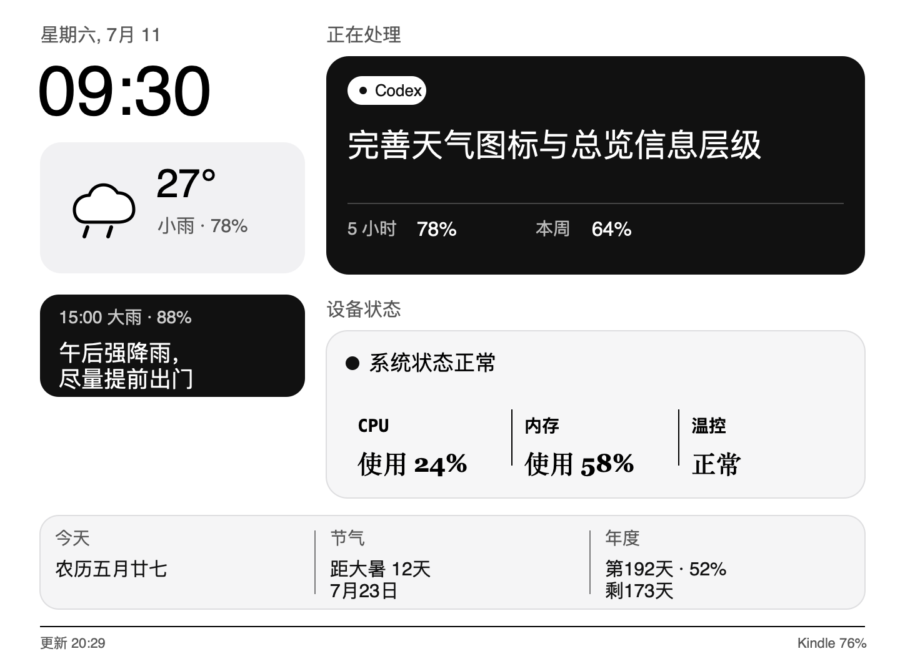

## v0.4.0 横竖双布局

v0.4.0 是一次完整的画幅、日历和设备守护升级：

- 为 Paperwhite 3 增加真正的 `1448 × 1072` 横版渲染，不旋转或缩放竖版页面。
- 横竖屏共享数据语义和视觉语言，但可以按照画幅特点增加、减少或重组模块。
- 重新平衡所有横版页面的视觉重心，不用拉高卡片、放大字号或堆叠无效信息填充空白。
- 以约 1 米桌面观看距离重新校准主标题、正文、指标、标签和辅助信息的字号与对比度。
- 日历改为完全本地的中国双历，并增加当前时间：公历、逐日农历、干支生肖、二十四节气、周次和年度进度。
- 删除日程、提醒事项和同步逻辑，不再申请 macOS Calendar / Reminders 权限。
- Mac App 首次启动默认开启 45%–55% Kindle 电池保护，并持久化用户选择。
- Kindle 始终保持固定 `1072 × 1448` 帧缓冲；横版由 Mac 生成原生布局并按用户选择预旋转最终设备帧。
- Kindle 在 Mac 暂时不可达时继续执行最后一次电池保护策略，守护退出时恢复正常充电。

> 以下截图全部由 v0.4.0 正式构建使用固定公开示例数据生成，不包含真实 Codex 会话、天气、设备状态或个人信息。竖版逻辑画布为 `1072 × 1448`，横版逻辑画布为 `1448 × 1072`；发送到 Paperwhite 3 的最终设备帧始终为 `1072 × 1448`。

### 横竖屏设计原则

| 约束 | 竖屏 | 横屏 |
| --- | --- | --- |
| 阅读方式 | 从上到下逐层阅读 | 左右并行扫视，再读取底部上下文 |
| 信息密度 | 保留最重要的主信息，减少并列内容 | 可增加与当前页面直接相关的状态、控制或连续性信息 |
| 模块关系 | 适合单列、纵向节奏 | 适合主次双栏、时间线、指标带和控制区 |
| 留白 | 给远距离阅读留下清晰分组 | 让内容覆盖完整画幅，但不机械拉伸卡片 |
| 一致性 | 共享数据、命名、黑白层级和电子墨水对比 | 不要求与竖版模块一一对应 |
| 例外 | 图片画布按内容比例留白 | 屏保允许有意保持安静和稀疏 |

设计遵循 Apple Design 的 Purpose、Simplicity 和 Craft：每个新增模块都必须帮助用户判断状态、完成操作或理解上下文；纯装饰内容不会因为屏幕还有空位而被加入。

字号不是按近距离阅读器设计，而是按约 1 米外的桌面信息牌重新分级：核心数字和当前状态最大，操作性正文保持稳定中字号，标签与更新时间只作为辅助层。放大后仍保留自然留白，不用拉伸卡片补齐画面。

### 完整页面截图

#### 1. 首页总览

首页用于回答“现在最值得关注什么”。竖版保持时间、天气风险、当前 Codex 工作和设备状态的纵向顺序；横版把时间与天气放在左侧，把当前工作和 Mac 健康放在右侧，并在底部加入农历、节气和年度进度。底部信息是一天级别的稳定上下文，不会增加刷新噪声。

<table>
  <tr>
    <th>竖屏 · 快速纵向扫读</th>
    <th>横屏 · 天气、工作和设备并行</th>
  </tr>
  <tr>
    <td>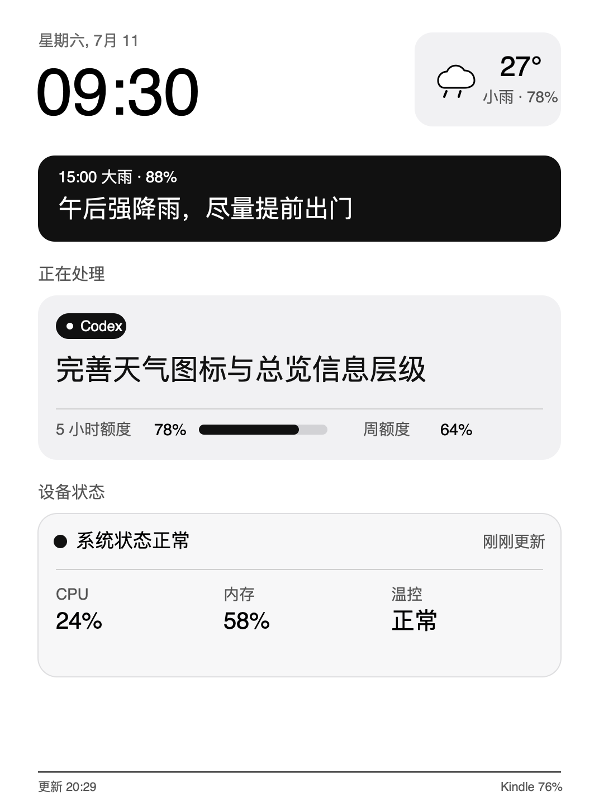</td>
    <td></td>
  </tr>
</table>

横版新增或重组：

- 左侧：时间、当前天气、最重要的降雨或出门建议。
- 右侧：Codex 当前任务、5 小时/周额度、Mac CPU/内存/温控。
- 底部：农历日期、下一节气、全年进度。
- 不加入日程、提醒事项或与当前判断无关的装饰卡片。

#### 2. Codex 工作看板

Codex 页面用于回答“现在在做什么、还能继续多久、下一步是什么”。竖版强调单个任务和额度；横版增加更完整的任务区域、双额度卡、完成标准和最近工作，让更宽的桌面状态牌能提供上下文连续性。

<table>
  <tr>
    <th>竖屏 · 当前任务优先</th>
    <th>横屏 · 任务、额度和最近工作</th>
  </tr>
  <tr>
    <td>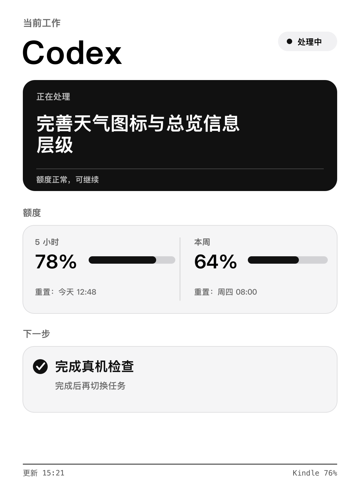</td>
    <td></td>
  </tr>
</table>

横版新增或重组：

- 主任务使用高对比黑色区域，远距离也能看到当前工作。
- 5 小时额度和周额度分别显示，不把不同时间窗口混为一个指标。
- 下一步和完成标准与任务相邻，减少切换上下文。
- 底部显示最近工作；没有数据时使用明确空状态，不显示内部占位文本。

#### 3. Markdown 文档

文档页用于在操作 Mac 时把步骤、清单或参考说明常驻在 Kindle 上。竖版沿单列顺序阅读；横版改为阅读器结构：左侧显示页码、阅读进度、剩余页数和翻页入口，右侧使用双栏正文。短文档允许纸面内部自然留白，长文档按页继续，不通过放大文字填满页面。

<table>
  <tr>
    <th>竖屏 · 单列步骤</th>
    <th>横屏 · 阅读状态栏与双栏正文</th>
  </tr>
  <tr>
    <td></td>
    <td>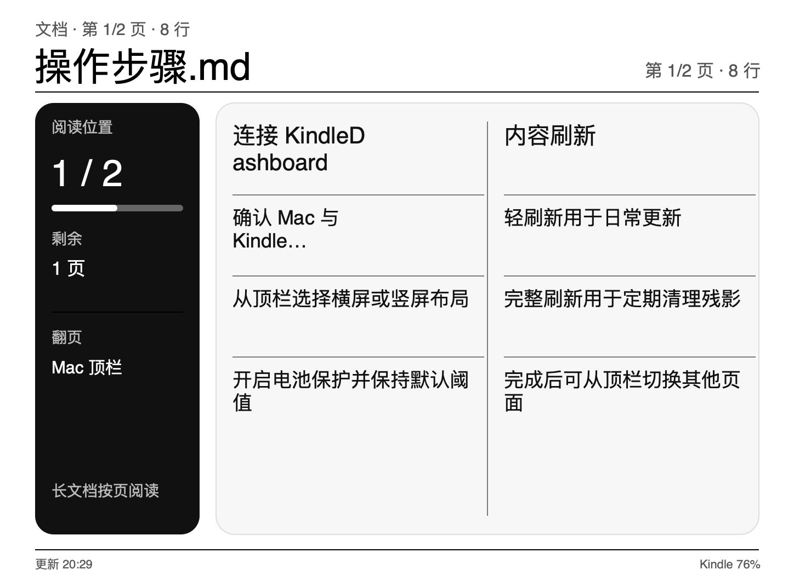</td>
  </tr>
</table>

横版新增或重组：

- 独立阅读位置栏：当前页、总页数、进度、剩余页数。
- 双栏正文按原始 Markdown 顺序分配，保留标题和正文层级。
- 页面容器覆盖可用阅读画布，但正文不会被拉大到失去可读性。
- 公开预览使用固定示例文档；实时页面读取用户在 Mac 顶栏选择的内容。

#### 4. 图片与截屏投射

投射页的主任务就是显示图片，因此横竖版都把画布作为唯一主表面，并按 `preserveAspectRatio="xMidYMid meet"` 完整容纳内容。没有图片时显示清晰的操作入口；有图片时不叠加天气、系统状态或其他无关模块。

<table>
  <tr>
    <th>竖屏 · 纵向图片画布</th>
    <th>横屏 · 宽幅图片画布</th>
  </tr>
  <tr>
    <td></td>
    <td></td>
  </tr>
</table>

横竖版共同规则：

- 保持图片比例，不裁掉主要内容。
- 空状态说明从 Mac 顶栏选择图片或截屏。
- 主画布可以根据图片比例产生留白，这是内容适配，不是页面未完成。
- 实际图片会被转换为 Kindle 可显示的 PNG 帧。

#### 5. 音乐

音乐页用于查看当前歌曲并进行轻量控制。竖版把歌曲、专辑和播放状态沿纵向排布；横版将当前歌曲和专辑信息放在上半区，把上一首、播放/暂停、下一首放入独立的底部控制区，避免上方卡片结束后留下没有归属的大块空白。

<table>
  <tr>
    <th>竖屏 · 歌曲与专辑</th>
    <th>横屏 · 播放信息与控制区</th>
  </tr>
  <tr>
    <td></td>
    <td>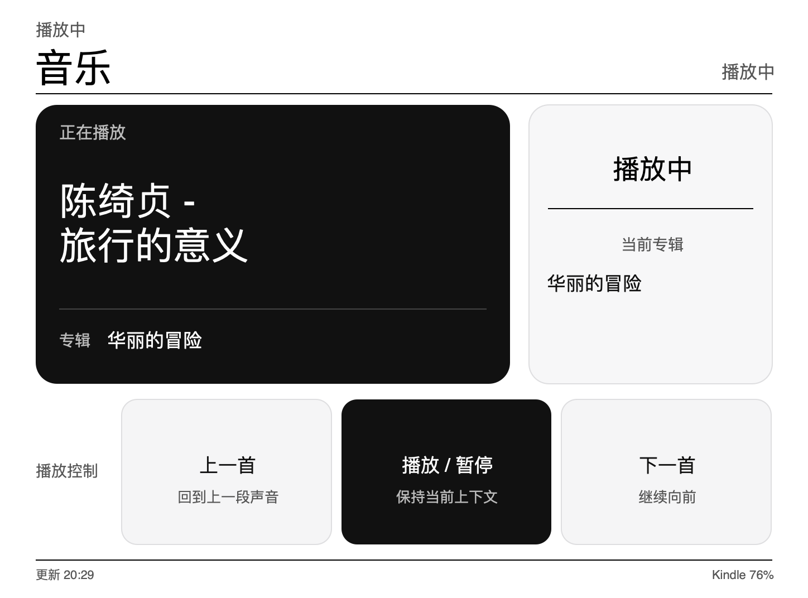</td>
  </tr>
</table>

横版新增或重组：

- 当前歌曲是最大视觉重点，播放状态和专辑作为次级信息。
- 控制区使用三个等权操作位，播放/暂停保持主要强调。
- 音乐未运行或未播放时显示明确状态，不伪造播放进度。
- 当前版本读取和控制 macOS Music；不申请日历或提醒事项权限。

#### 6. 天气

天气页用于回答“现在是什么天气、接下来会怎样、要不要调整出行”。竖版按当前天气、风险提醒和逐时预报向下阅读；横版让当前天气和未来五个时间点同时可见，并在底部放置体感、湿度、风、降雨峰值和出门建议。

<table>
  <tr>
    <th>竖屏 · 当前天气与逐时列表</th>
    <th>横屏 · 当前天气、时间线与行动建议</th>
  </tr>
  <tr>
    <td>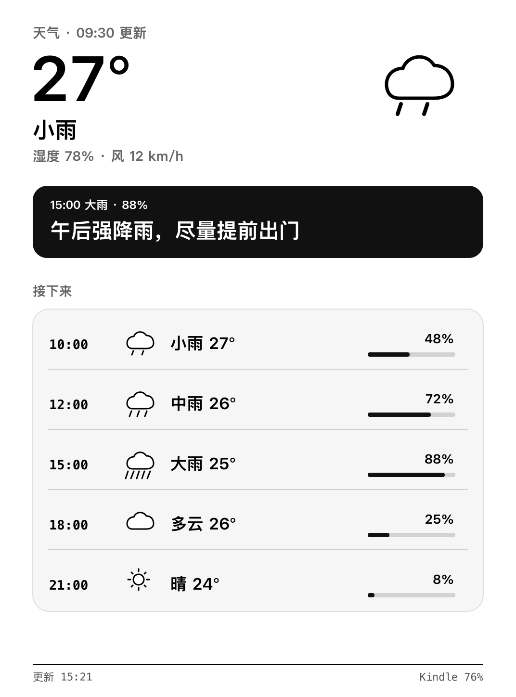</td>
    <td>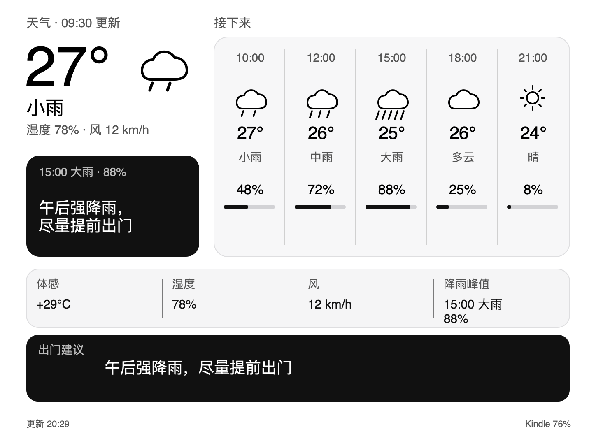</td>
  </tr>
</table>

横版新增或重组：

- 左侧突出当前温度、天气图标、湿度/风和最重要的降雨风险。
- 右侧并列显示未来五个时间点的天气、温度和降雨概率。
- 底部指标带补充体感、湿度、风与降雨峰值。
- 最下方黑色建议区把天气数据转换为可执行提示。
- 天气不可用时显示稳定空状态，不让旧数据伪装成实时结果。

#### 7. 中国双历

日历页不再读取任何日程，也不需要同步。它用于理解当前时间、今天、公历月份、农历和季节节律。竖版适合依次读取日期与时间、月历、节气和年度进度；横版把日期、当前时间、农历与整月视图并列，并增加本月两个节气的准确日期。

<table>
  <tr>
    <th>竖屏 · 今日、月历和季节信息</th>
    <th>横屏 · 今日双历与完整月视图</th>
  </tr>
  <tr>
    <td></td>
    <td>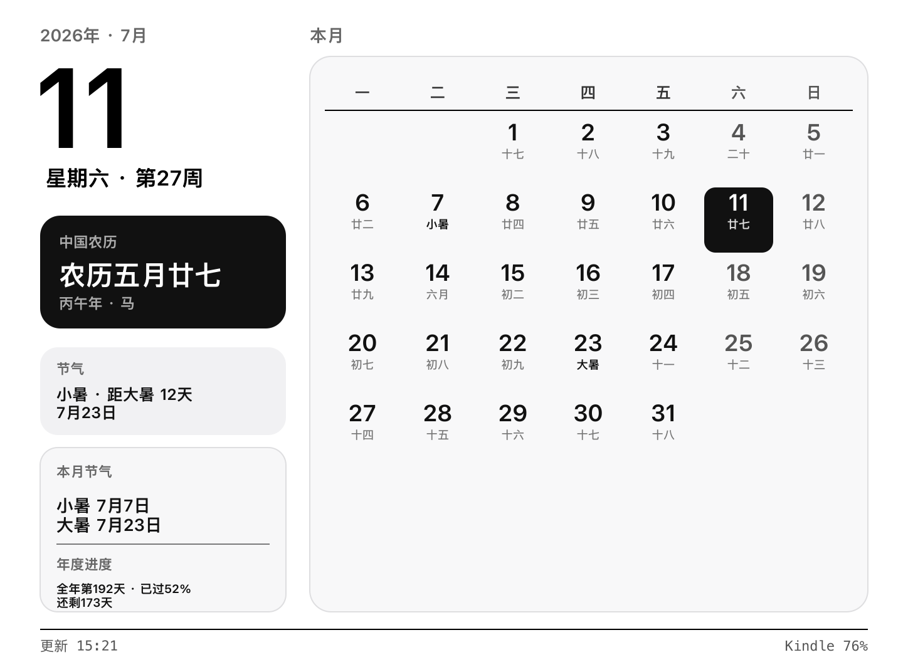</td>
  </tr>
</table>

日历数据包括：

- 公历年、月、日、星期与 ISO 风格周次。
- 当前时间；竖版和横版都使用远距离可读的大号数字。
- 每个公历日期下方的农历日期；节气当天优先显示节气名称。
- 农历月日、干支纪年和生肖。
- 二十四节气当天提示、上一/下一节气和倒计时。
- 本月节气名称及公历日期。
- 全年第几天、已过百分比和剩余天数。

节气通过太阳视黄经计算后转换为本地日期。2026 年 24 个节气已与香港天文台发布的日期逐项核对。日历不包含：

- macOS Calendar 日程。
- Reminders 提醒事项。
- CalDAV、iCloud 或其他同步账号。
- 任何日历/提醒事项权限声明。

#### 8. 专注

专注页只服务一件事：让当前工作在视野中保持稳定。竖版突出任务和建议专注时长；横版同时显示任务、50 分钟专注块和底部执行环境，帮助用户判断是否应该关闭额外页面或休息。

<table>
  <tr>
    <th>竖屏 · 单任务状态牌</th>
    <th>横屏 · 任务、时间块和环境</th>
  </tr>
  <tr>
    <td></td>
    <td></td>
  </tr>
</table>

横版新增或重组：

- 当前任务和建议时长保持两个独立视觉区域。
- 底部展示“只做一件事”“关闭额外页面”和 Mac 当前负载。
- 页面不运行倒计时动画，避免频繁刷新电子墨水屏。
- 结束提示强调离开屏幕休息，而不是继续增加任务。

#### 9. Mac 系统健康

系统页用于快速判断是否需要打开活动监视器。竖版提供状态、CPU、内存、温控、磁盘和高占用进程；横版增加连续运行信息，并让进程列表延伸到画面下部，使状态与原因形成完整关系。

<table>
  <tr>
    <th>竖屏 · 指标与进程列表</th>
    <th>横屏 · 状态、连续运行和进程原因</th>
  </tr>
  <tr>
    <td>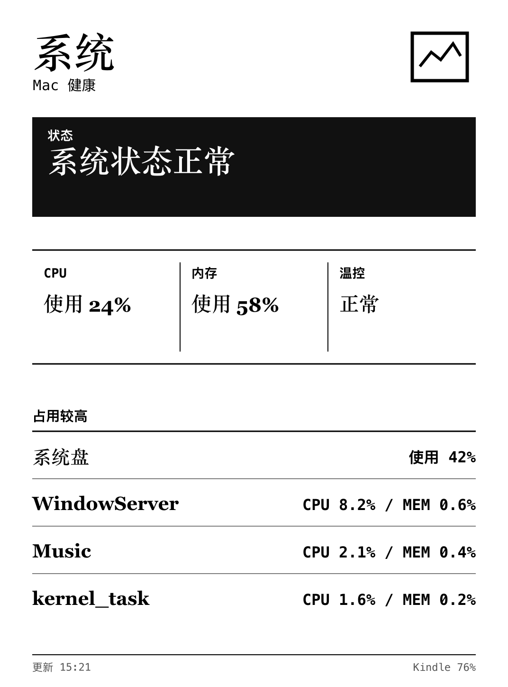</td>
    <td>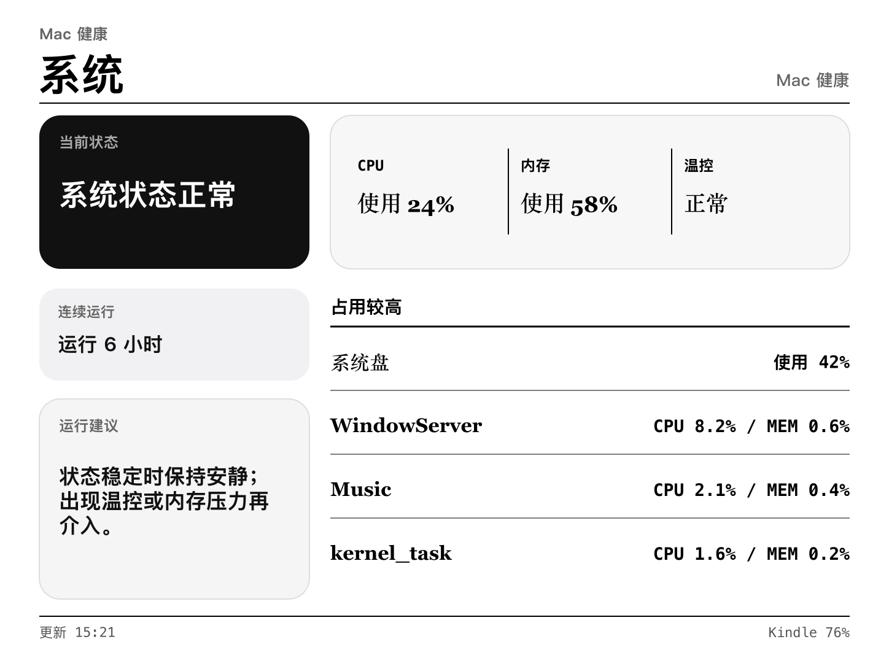</td>
  </tr>
</table>

横版新增或重组：

- 左侧：系统判断、连续运行状态和处理建议。
- 右侧：CPU、内存、温控及高占用进程。
- 只有温控、CPU 或内存压力达到阈值时才给出干预建议。
- 进程信息只显示名称和聚合资源占用，不显示文档内容或用户数据。

#### 10. 低打扰屏保

屏保是有意保持稀疏的页面。竖版和横版都以时间为中心，只保留日期、农历、节气和 Kindle 电量。这里的留白用于降低干扰和残影，不会为了“页面充实”加入天气、任务或系统卡片。

<table>
  <tr>
    <th>竖屏 · 纵向安静显示</th>
    <th>横屏 · 宽幅安静显示</th>
  </tr>
  <tr>
    <td>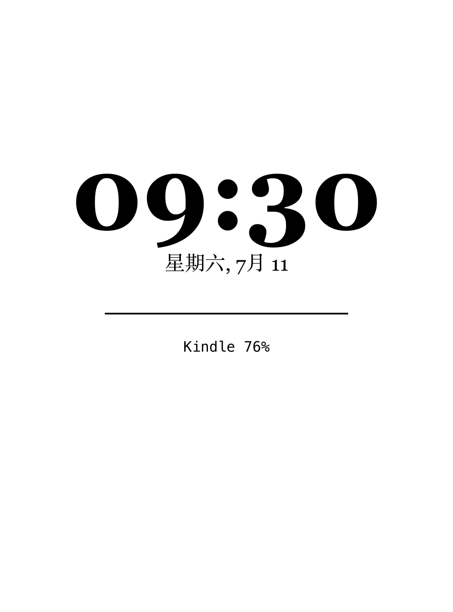</td>
    <td>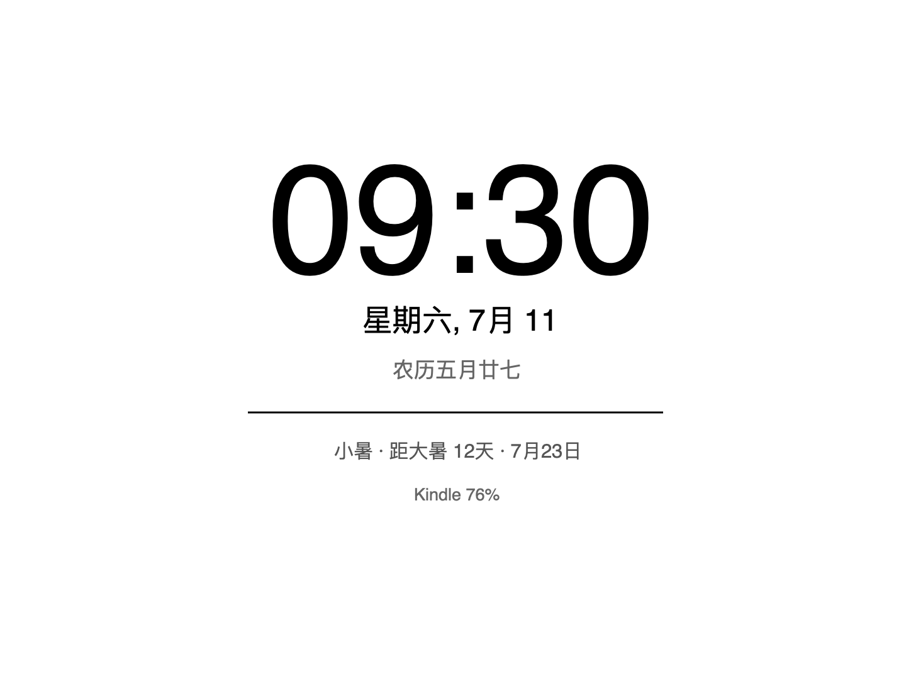</td>
  </tr>
</table>

### v0.4.0 完整更新清单

#### 渲染与画幅

- `KindleOrientation` 增加持久化的横竖屏状态。
- 设置中新增“横屏放置方向”，可在顺时针和逆时针横放之间切换；方向只影响最终 Kindle 画面的预旋转，不改变横版 UI 结构。
- SVG 渲染器按方向输出真实帧：
  - 竖屏：`1072 × 1448`。
  - 横屏原生构图 `/native.png`：`1448 × 1072`。
  - Kindle 最终设备帧 `/frame.png`：始终为 `1072 × 1448`，由 Mac 按横放方向预旋转。
- 十个页面都拥有独立横版布局，不使用整页旋转或等比缩放。
- 横屏内容统一建立底部连续性，但每页使用与自身用途相关的信息。
- 图片页继续使用自适应比例画布；屏保继续保留有意留白。
- CLI 增加 `--landscape`，可与 `--dump-preview`、`--dump-mode` 和实时 SVG 导出配合。

#### 日历与中国传统历法

- 使用 Foundation 中国农历日历生成农历月日。
- 增加干支纪年和生肖。
- 计算并显示二十四节气。
- 月历每个单元格显示一个次级标签：节气优先，否则显示农历日期。
- 横竖日历首页都增加当前时间，并扩大星期、农历和月历辅助文字。
- 增加下一节气倒计时、本月节气、周次和年度进度。
- 删除所有 Calendar / Reminders AppleScript、权限描述、日程列表和同步提示。
- 增加 `--dump-solar-terms <year>` 诊断命令。

#### Mac App

- 新安装默认启用电池保护。
- 电池保护开关通过 `UserDefaults` 持久化；用户主动关闭后不会被下次启动覆盖。
- 横竖布局选择通过 `UserDefaults` 持久化。
- 顶栏设置提供竖屏和横屏选择，并显示当前生效状态。
- App bundle 不再包含日历和提醒事项隐私说明，只保留音乐控制和截屏所需说明。

#### Kindle 扩展

- Kindle 端不检测也不改变系统方向，始终接收固定 `1072 × 1448` 的 `/frame.png`。
- 横版方向完全由 Mac 的“顺时针横放 / 逆时针横放”设置决定，默认逆时针横放。
- Mac 暂时不可达时，充电守护继续执行最后收到的保护策略。
- 充电守护退出或 Dashboard 停止时恢复正常充电。
- 轻刷新明确使用 `GL16`，全刷新明确使用 `GC16`。
- 不再向旧 Kindle 驱动传入可能阻塞刷新的 `-w`。
- 轻刷新和完整刷新的计时保持独立。

#### 文档与验证

- README 增加全部十个页面的横竖屏截图和逐页说明。
- 设计原则明确禁止通过机械拉伸模块、字号或内边距填补空白。
- Kindle 安装文档增加设备方向、刷新波形和电池保护说明。
- Roadmap 区分已完成横版渲染和仍需完成的 Paperwhite 3 横版真机验收。

### 验证状态

| 检查项 | v0.4.0 结果 |
| --- | --- |
| Swift Debug 构建 | 通过 |
| Swift Release / App bundle 构建 | 通过 |
| App 签名 `codesign --verify --deep --strict` | 通过 |
| App 架构 | Apple Silicon `arm64` |
| 10 个竖版 SVG | 全部通过 XML 结构检查和视觉审阅 |
| 10 个横版 SVG | 全部通过 XML 结构检查和视觉审阅 |
| 实际 App 竖版 PNG | `1072 × 1448` |
| 实际 App 横版原生 PNG | `/native.png` 为 `1448 × 1072` |
| 实际 Kindle 设备帧 | 横竖模式的 `/frame.png` 均为 `1072 × 1448` |
| 电池保护运行时状态 | 默认开启，45%–55% |
| 横屏放置方向 | 顺/逆时针预旋转均由 Mac 端验证，默认逆时针 |
| 2026 年二十四节气 | 24/24 日期与香港天文台资料一致 |
| Shell 脚本语法 | `start.sh`、`stop.sh`、`render_once.sh` 通过 |
| Paperwhite 3 竖屏 | 已实机验证 |
| Paperwhite 3 横屏 | 固定帧缓冲、方向与裁切已完成实机确认 |

### 从旧版本升级

1. 在 Mac 上重新构建并替换 `KindleDashboard.app`。
2. 将最新版 `kindle-extension/kindledashboard/` 同步到 Kindle。
3. 从 KUAL 停止旧 Dashboard，再启动新版，让脚本记录正确的初始方向。
4. 在 Mac 顶栏“设置”中选择竖屏或横屏。
5. 检查菜单中的 Kindle 回执，确认轻刷新/完整刷新和设备电量正常上报。
6. 长期插电使用时建议保留默认 45%–55% 电池保护。

升级不会要求导入日历账号或重新授权 Calendar / Reminders。若曾给旧版本授权，可在 macOS 系统设置中手动撤销。

### 已知限制

- 横版已通过 Mac 端真实运行帧验证，但 Paperwhite 3 真机横屏仍需要最终验收。
- 天气位置目前由现有天气数据源决定，尚未提供独立位置设置界面。
- 音乐控制目前面向 macOS Music，未实现完整播放进度与第三方播放器适配。
- Markdown 支持分页阅读，但顶栏内还没有更细的目录、跳页和搜索控件。
- 截图投射尚未提供交互式裁剪、灰阶和抖动参数。
- 本地 HTTP 服务默认监听 `8787`，适合可信局域网；不要直接暴露到公网。

## 项目定位

KindleDashboard 不是传统意义上的第二显示器。它把 Kindle 当成一块低频、低功耗、强可读性的电子墨水状态屏：

- Mac 端运行一个本地服务和顶栏控制器。
- Kindle 端通过 KUAL 扩展拉取 Mac 渲染好的 PNG 画面。
- 所有核心内容都为 Kindle Paperwhite 3 的竖屏 `1072 × 1448` 和横屏 `1448 × 1072` 分别排版。
- 页面以中文为主，强调远距离一眼能看懂，而不是把电脑屏幕缩小塞进去。

这个方案特别适合：

- 桌面常驻信息牌：天气、时间、双历、音乐、系统状态。
- Codex / agent 工作板：显示当前任务、最近工作、下一步。
- 操作步骤对照屏：把 Markdown 文档投射到 Kindle，边操作边看。
- 低打扰屏保：离开电脑时显示时间、日期或简单状态。

## 当前能力

- **Mac 顶栏入口**：从菜单栏切换 Kindle 页面、强制刷新、切换背光、查看状态。
- **Kindle Clean Dashboard**：暂停 Kindle 原生状态栏，避免系统时间和电量覆盖顶栏并产生白角。
- **分层刷新**：默认 1 分钟轻刷新、5 分钟全刷新，兼顾残影和寿命。
- **设备电量回传**：Kindle 把电量和充电状态上报给 Mac，页面右下角紧凑显示。
- **Markdown 投射**：上传或输入 Markdown，按页显示，适合步骤文档。
- **图片/截图投射**：把图片或屏幕截图转换为 Kindle 画面。
- **音乐控制页**：显示播放状态，并预留上一曲、播放/暂停、下一曲交互。
- **横竖双布局**：Mac 顶栏切换真实竖版或横版帧，选择会在下次启动时保留。
- **本地双历**：不访问系统日历或提醒事项，本地显示公历、农历和二十四节气。
- **默认电池保护**：首次启动默认开启 45%–55% 充电守护，用于长期插电时降低电池压力。

## 适配设备

已实机验证：

| 设备 | 状态 | 说明 |
| --- | --- | --- |
| Kindle Paperwhite 3 / PW3 | 竖屏已实机验证 | `1072 × 1448` 竖版；`1448 × 1072` 横版帧已完成本机渲染 QA，仍需在设备横屏状态复核 FBInk |

理论上可尝试：

| 设备 | 预期 | 注意 |
| --- | --- | --- |
| 其他支持 KUAL 和 FBInk 的 Kindle | 需要适配 | 分辨率、DPI、状态栏行为可能不同 |
| Kindle Oasis / Voyage | 需要适配 | 需要重新校准画布、字体和触控区域 |

不建议当前版本直接使用在：

- 未越狱或无法运行 KUAL 的 Kindle。
- 彩屏或 Android e-ink 设备。它们可以用浏览器方案，但不是本项目当前目标。

## 法律与安全边界

本仓库不提供 Kindle 越狱工具，不打包越狱文件，也不写逐步越狱教程。

你需要自己确认设备所有权、当地法律和风险，并参考上游资料完成 Kindle 的 post-jailbreak 环境准备：

- [Kindle Modding: Jailbreaking](https://kindlemodding.org/jailbreaking/)
- [Kindle Modding: After Jailbreak](https://kindlemodding.org/jailbreaking/AfterJailbreak/)
- [Kindle Modding: Post Jailbreak / Hotfix](https://kindlemodding.org/jailbreaking/post-jailbreak/setting-up-a-hotfix/)
- [KUAL](https://kindlemodding.org/kual/)
- [FBInk](https://github.com/NiLuJe/FBInk)

本项目只处理 post-jailbreak 之后的本地仪表盘、KUAL 启动脚本和 Mac 控制端。

## 系统架构

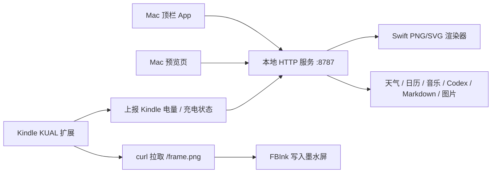
```mermaid
flowchart LR
  MacMenu["Mac 顶栏 App"] --> Server["本地 HTTP 服务 :8787"]
  Browser["Mac 预览页"] --> Server
  Server --> Renderer["Swift PNG/SVG 渲染器"]
  Server --> Data["天气 / 日历 / 音乐 / Codex / Markdown / 图片"]
  KindleKUAL["Kindle KUAL 扩展"] --> Fetch["curl 拉取 /frame.png"]
  Fetch --> FBInk["FBInk 写入墨水屏"]
  KindleKUAL --> Status["上报 Kindle 电量 / 充电状态"]
  Status --> Server
```

Mac 负责：

- 运行顶栏菜单。
- 提供 `http://<mac-ip>:8787/frame.png`。
- 渲染所有页面，保证 Kindle 只需要拉取一张图片。
- 接收 Kindle 状态上报。
- 保存当前页面、Markdown 页码、图片页、刷新策略等控制状态。

Kindle 负责：

- 在 KUAL 中启动或停止 dashboard。
- 用 `curl` 拉取 Mac 端 PNG。
- 用 `fbink` 显示画面。
- 在 Clean Dashboard 模式中暂停原生状态栏。
- 按 Mac 设置执行轻刷新和全刷新，并把实际执行模式回报给 Mac。
- 上报电量和充电状态。

## 快速开始

### 1. 克隆项目

```bash
git clone https://github.com/Mibslee/kindledashboard.git
cd kindledashboard
```

### 2. 构建 Mac App

```bash
./scripts/build-app.sh
```

脚本会生成 `dist/KindleDashboard.app`。将它拖入“应用程序”文件夹，之后直接双击启动即可；它会常驻 Mac 顶栏，不依赖终端窗口。需要随系统启动时，在顶栏菜单的“设置”中开启“登录时自动启动”。

开发调试时仍可使用：

```bash
swift run KindleDashboard
```

App 启动后访问：

```text
http://127.0.0.1:8787/
http://127.0.0.1:8787/frame.png
```

`/` 是 Mac 预览和控制页，`/frame.png` 是 Kindle 实际显示的画面。

### 3. 找到 Mac 局域网 IP

```bash
ipconfig getifaddr en0
```

假设返回：

```text
192.168.1.23
```

后续命令里的 `<mac-ip>` 就替换成这个地址。

### 4. 准备 Kindle 环境

Kindle 侧需要已经具备：

- 已完成你自己负责的 post-jailbreak 环境。
- KUAL 可打开。
- FBInk 可用。
- Kindle 与 Mac 在同一局域网中，或 Kindle 能访问 Mac 的 `8787` 端口。

在 Kindle 上可以先测试 Mac 服务是否可达：

```bash
curl -I http://<mac-ip>:8787/frame.png
```

预期能看到 `HTTP/1.1 200 OK`。

### 5. 安装 KUAL 扩展

如果 Kindle 通过 USB 挂载到了 Mac 的 `/Volumes/Kindle`：

```bash
scripts/sync-kindle-extension.sh <mac-ip>
diskutil eject /Volumes/Kindle
```

脚本会把 `kindle-extension/kindledashboard` 同步到 Kindle 的 `extensions/kindledashboard`，并把 Mac IP 写入 Kindle 端配置。

如果手动安装，目标结构应类似：

```text
/Volumes/Kindle/extensions/kindledashboard/
  menu.json
  bin/
    show_once.sh
    render_once.sh
    start.sh
    stop.sh
    start_clean_dashboard.sh
    stop_clean_dashboard.sh
    restore_statusbar.sh
```

### 6. 在 Kindle 上启动

打开 KUAL，进入 `KindleDashboard`：

- `Show Once`：只渲染一次，用于快速测试。
- `Start Auto Refresh`：常规自动刷新。
- `Start Clean Dashboard`：推荐日常使用，暂停 Kindle 原生状态栏并自动刷新。
- `Stop Clean Dashboard`：停止 dashboard 并恢复 Kindle 状态栏。
- `Restore Statusbar`：手动恢复状态栏，用于异常恢复。

首次建议使用：

```text
Start Clean Dashboard
```

如果页面稳定显示，并且顶部不再出现 Kindle 原生时间和电量，说明 Clean Dashboard 模式正常。

## 日常使用

### Mac 顶栏控制端

Mac 顶栏控制端是这个项目的核心亮点：Kindle 只负责稳定显示，真正的控制入口留在 Mac 上。

这样设计有三个原因：

- Kindle 触控区域少，顶部还容易和系统下拉菜单冲突。
- e-ink 不适合高频交互，Mac 菜单更快、更确定。
- 所有高级设置留在 Mac 上，Kindle 端就能保持“像信息牌一样安静”。

当前顶栏菜单包含：

| 控制项 | 作用 | 用户收益 |
| --- | --- | --- |
| 页面切换 | 首页、Codex、音乐、天气、日历、专注、系统、屏保、文档、图片 | 不碰 Kindle 就能换内容 |
| 立即刷新 Kindle | 请求 Kindle 马上拉取新画面 | 切换页面或更新文档后立即生效 |
| Kindle 背光 | 开关 Kindle 前光，并在菜单里显示已开启/已关闭 | 夜间或弱光环境下不用进 Kindle 设置 |
| 电池保护 | 默认开启 45%-55% 充电守护，并记住用户选择 | 长期插电时减少满电压力 |
| 横竖布局 | 在 `1072 × 1448` 竖版与 `1448 × 1072` 横版之间切换 | 按 Kindle 摆放方式使用独立排版 |
| 刷新策略 | 调整轻刷新和全刷新频率，页面切换立即轻刷新 | 明确知道屏幕为何何时刷新，并按使用场景控制闪屏频率 |
| Markdown 文档 | 选择 `.md` / `.markdown` / 文本文档并分页投射 | 操作步骤可以放在 Kindle 上对照 |
| 图片/截图投射 | 选择图片或投射当前截屏 | 临时参考图、流程图、截图可直接上屏 |
| 音乐控制 | 播放/暂停、上一首、下一首 | Kindle 作为桌面音乐状态牌时可顺手控制 |

背光、电池保护、自动轮换这类开关不是只写成“开/关”，菜单项会直接显示当前状态，并用 macOS 菜单勾选状态同步反馈。

### 从 Mac 切换页面

启动 `KindleDashboard` 后，Mac 顶栏会出现 KindleDashboard 图标。菜单中可以切换：

- 首页
- Codex 工作板
- 音乐
- 天气
- 日历
- 专注
- 系统
- 屏保
- Markdown 文档
- 图片/截图

切换页面后，Mac 会立即让 Kindle 轻刷新一次，不必等下一轮定时刷新。

切换横竖布局时，Mac 会先生成对应尺寸的原生构图；横版再按“顺时针横放 / 逆时针横放”预旋转为固定 `1072 × 1448` 设备帧。Kindle 扩展不检测也不改变系统方向，用户只需按菜单所选方向手动横放设备。

### 从 Kindle 切换页面

当前版本优先使用 Mac 顶栏控制。Kindle 屏幕顶部左侧的图标区域不会作为主要入口，因为它容易与 Kindle 系统下拉菜单产生冲突。

后续如果增加 Kindle 端手动触控，会采用更低风险的底部或侧边触控区域。

### 强制刷新

Mac 菜单提供即时刷新。适合：

- 刚切换页面。
- 刚更新 Markdown 或图片。
- 看到 e-ink 残影。
- Kindle 网络短暂断开后恢复。

Kindle 自动刷新策略仍会继续运行。

## 页面说明

### 首页

首页是默认状态屏。它回答三个问题：

- 现在是什么时间和天气？
- 今天有没有下一件要注意的事？
- Mac / Kindle 是否处于可用状态？

底部小卡片可用于天气、时间、音乐、日历等常驻小组件。

### Codex 工作板

用于显示 agent / Codex 相关状态。设计原则是只显示能帮助用户判断“现在要不要看电脑”的信息：

- 当前状态。
- 最近任务。
- 下一步。
- 关键异常或等待动作。

不显示原始端口、本地 URL、调试字段等低价值信息。

### 音乐

用于桌面播放场景：

- 当前播放状态。
- 曲目和艺人。
- 上一曲 / 播放暂停 / 下一曲。

如果系统没有播放音乐，会显示明确的未播放状态，避免误以为数据坏了。

### 天气

适合放在桌面常驻：

- 当前温度。
- 体感温度。
- 湿度。
- 天气图形符号。
- 简短行动建议。

### 日历

用于快速确认日期和季节信息，不读取日程，也不需要同步或授权：

- 公历月历与今天高亮。
- 每个日期对应的农历日期。
- 干支纪年与生肖。
- 二十四节气及下一节气倒计时。
- 当前周次、全年天数进度与剩余天数。

### Markdown 文档

适合把操作步骤、排障手册、部署清单扔到 Kindle 上对照。

页面过长时，Mac 端会按 Kindle 阅读尺寸分页。你可以在 Mac 端切换上一页 / 下一页，然后立即刷新 Kindle。

### 图片 / 截图

适合显示：

- 操作截图。
- 设计参考。
- 二维码或静态说明图。
- 小尺寸流程图。

图片会转为适合 e-ink 的黑白画面。复杂彩色截图建议先裁剪，避免文字过小。

## 刷新策略

Kindle 的 e-ink 屏幕不适合像普通显示器一样高频刷新。当前默认策略：

| 类型 | 默认频率 | 用途 |
| --- | --- | --- |
| 轻刷新 | 1 分钟一次 | 更新时间、状态、小变化，减少闪屏 |
| 全刷新 | 5 分钟一次 | 清理残影，恢复画面干净度 |
| 立即刷新 | 页面切换或手动触发 | 让切换马上生效 |

这一策略比“每次都全刷”更适合长期桌面使用。Mac 顶栏设置里可以分别调整轻刷新和全刷新频率：日常桌面信息牌建议保持 1 分钟轻刷新、5 分钟全刷新；如果只看静态文档或图片，可以适当拉长全刷新间隔，减少闪屏。

## Clean Dashboard 模式

普通 KUAL 应用运行时，Kindle 原生系统可能会在顶部周期性局部刷新时间和电量。这个行为会把深色顶栏左右角刷白。

`Start Clean Dashboard` 会尽量暂停原生状态栏，再渲染 dashboard，因此：

- 不再需要为 Kindle 原生状态栏预留顶部白边。
- 顶栏可以贴近屏幕上沿，屏幕利用率更高。
- 不容易出现系统时间、电池覆盖自定义 UI 的问题。

如果退出后状态栏没有恢复，使用 KUAL 中的：

```text
Restore Statusbar
```

## 背光控制

Mac 顶栏提供背光开关入口，菜单中会显示：

- `Kindle 背光：已开启（10）`
- `Kindle 背光：已关闭`

Kindle 端会尽量调用设备可用的前光控制命令。当前默认亮度级别是 `10`，后续可以扩展为菜单滑块或多档亮度。

不同 Kindle 固件和工具链对前光命令支持不完全一致。如果背光开关无效，优先确认 Kindle 端日志和设备是否暴露 frontlight 控制接口。

## 电池保护

这个项目经常会让 Kindle 长期插电使用。长期满电并持续充电会增加电池压力。

Mac App 首次启动默认开启充电守护，用户关闭后会记住选择：

- 目标区间约为 45% - 55%。
- 高于上限时尝试暂停充电。
- 低于下限时恢复充电。
- Mac 暂时离线时继续按最后一次保护设置运行。
- 停止 Dashboard 或守护进程退出时恢复正常充电。
- 失败时仍可通过 KUAL 手动 restore。

Mac 顶栏菜单会显示当前保护状态：

- `电池保护：已开启（45%-55%）`
- `电池保护：已关闭（45%-55%）`

注意：

- 这是实验功能，不同 Kindle 硬件和内核接口可能不同。
- 不应把它当成保证电池寿命的硬件级 BMS。
- 第一次使用前先跑短测试，不要无人值守长期运行。

KUAL 中可用入口：

- `Charge Guard Test`
- `Restore Charging`
- `Battery Probe`

## HTTP API

Mac 服务默认监听：

```text
http://127.0.0.1:8787
```

常用端点：

| Endpoint | 说明 |
| --- | --- |
| `/` | Mac 浏览器预览和控制页 |
| `/frame.png` | Kindle 实际拉取的 PNG 帧 |
| `/frame.svg` | 调试用 SVG |
| `/mode/<name>` | 切换页面 |
| `/refresh` | 请求 Kindle 立即刷新 |
| `/kindle/status?battery=93&charging=1` | Kindle 上报电量 |
| `/api/state` | 当前状态 JSON |

常见页面名：

```text
home
codex
music
weather
calendar
focus
system
screensaver
document
image
```

示例：

```bash
curl "http://127.0.0.1:8787/frame.png?mode=home" --output home.png
curl "http://127.0.0.1:8787/kindle/status?battery=93&charging=1"
```

## 项目结构

```text
kindledashboard/
  Package.swift
  Sources/
    KindleDashboard/
      main.swift
  kindle-extension/
    kindledashboard/
      menu.json
      bin/
        show_once.sh
        render_once.sh
        start.sh
        stop.sh
        start_clean_dashboard.sh
        stop_clean_dashboard.sh
        restore_statusbar.sh
        battery_probe.sh
        charge_guard_test.sh
        charge_restore.sh
  scripts/
    sync-kindle-extension.sh
  docs/
    kindle-device-setup.md
    kiosk-mode-research.md
    roadmap.md
    assets/previews/
  CHANGELOG.md
  CONTRIBUTING.md
  SECURITY.md
  LICENSE
```

## 开发与验证

### 构建

```bash
swift build
```

### 启动

```bash
swift run KindleDashboard
```

### 生成预览图

公开预览使用固定示例数据，不会写入当前 Codex 任务、日历或本机状态：

```bash
swift run KindleDashboard --dump-preview home > /tmp/kindledashboard-home.svg
sips -s format png /tmp/kindledashboard-home.svg --out docs/assets/previews/home.png

swift run KindleDashboard --dump-preview weather > /tmp/kindledashboard-weather.svg
sips -s format png /tmp/kindledashboard-weather.svg --out docs/assets/previews/weather.png

swift run KindleDashboard --dump-preview calendar --landscape > /tmp/kindledashboard-calendar-landscape.svg
```

`--dump-mode <mode>` 会读取实时天气、Codex 和 Mac 状态，只适合本地视觉检查，不应直接用于公开仓库截图。

### 同步到 Kindle

```bash
scripts/sync-kindle-extension.sh <mac-ip>
diskutil eject /Volumes/Kindle
```

### 发布前检查

```bash
swift build
git status --short
```

隐私检查建议：

```bash
rg -n "192\\.168\\.|10\\.|172\\.|/Users/|token|secret|password|Bearer|sk-|ghp_|github_pat" .
```

确认不要提交：

- 本机用户名路径。
- 真实局域网 IP。
- 个人截图。
- Kindle 运行日志。
- `.build/`。
- `.DS_Store`。

## 排障

### Kindle 显示 `dashboard render failed`

先确认 Mac 服务能访问：

```bash
curl -I http://<mac-ip>:8787/frame.png
```

再确认 Kindle 端配置中的 Mac IP 是否正确。重新 USB 连接后可以再次运行：

```bash
scripts/sync-kindle-extension.sh <mac-ip>
```

### 页面显示一下就回桌面

通常是 KUAL 脚本异常退出或 FBInk 命令失败。优先查看 Kindle 扩展目录下的日志：

```text
/mnt/us/extensions/kindledashboard/kindledashboard.log
```

### 顶部又出现 Kindle 原生时间或电量

使用 KUAL 的：

```text
Start Clean Dashboard
```

如果已经启动但仍出现，执行：

```text
Restore Statusbar
Start Clean Dashboard
```

### 画面有残影

等待下一次 5 分钟全刷新，或从 Mac 菜单手动强制刷新。

### 背光控制无效

不同固件暴露的前光控制接口不同。先确认普通 Kindle 设置里前光可用，再检查 Kindle 日志。

### 长文档看不全

Markdown 投射不是无限滚动，而是分页显示。请在 Mac 端切换页码后刷新 Kindle。

## 设计原则

KindleDashboard 的 UI 不追求把电脑窗口复制过去，而是遵循副屏信息牌的规则：

- 只显示能帮助下一步行动的信息。
- 重点信息必须远距离一眼可读。
- 少用细线、小字和密集表格。
- 横竖版使用独立信息架构，不通过旋转或等比缩放复用布局。
- 竖版强调纵向阅读节奏，横版强调左右分区和并行扫视。
- 调试字段、URL、端口等默认不出现在 Kindle 主界面。
- 黑白对比要强，但避免大面积无意义黑边。

## Roadmap

近期方向：

- 更完整的音乐播放控制。
- 更清晰的 Markdown 分页控制。
- 支持从 Mac 菜单选择底部小组件组合。
- 增加更多 Kindle 型号的分辨率适配。
- 增加截图投射的裁剪和对比度调节。
- 在 Paperwhite 3 真机横屏状态验证 FBInk 方向、裁切与触控坐标。

暂不作为 v0.2 目标：

- 把 Kindle 做成真正的 macOS 扩展显示器。
- 高频实时鼠标键盘交互。
- 跨公网访问。
- 直接打包或分发 jailbreak 工具。

## 参考项目

README 的结构参考了 [Mibslee/emoji-alpha-matting](https://github.com/Mibslee/emoji-alpha-matting)：先给出清晰定位、预览、快速开始，再补充技术细节和复现步骤。

Kindle 生态参考：

- [Kindle Modding](https://kindlemodding.org/)
- [KUAL](https://kindlemodding.org/kual/)
- [FBInk](https://github.com/NiLuJe/FBInk)

## License

MIT License. See [LICENSE](LICENSE).

Copyright (c) 2026 ShaneStudio
